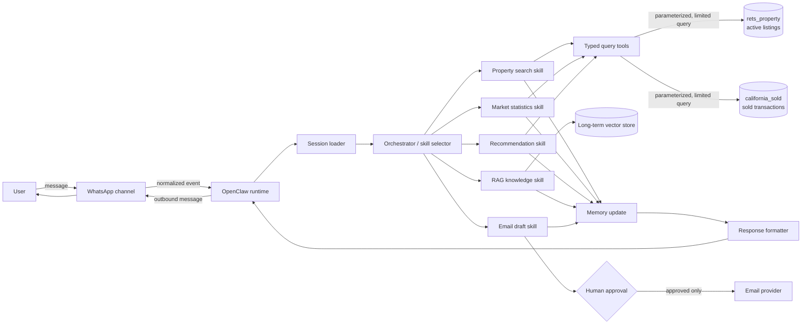
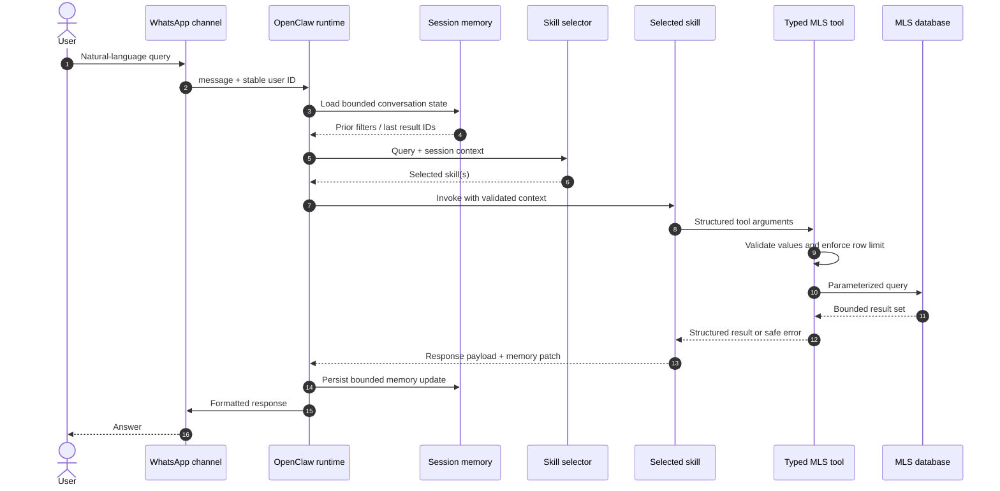

# Week 1: OpenClaw Architecture Fundamentals

## Purpose and scope

This document defines the target architecture for the IDX Exchange multi-agent real estate assistant. It covers the Week 1 concepts and the complete request path from WhatsApp through OpenClaw skills to the MLS databases.

Week 1 is an architecture deliverable. The components and database paths below are the design contract for later implementation weeks; they are not claims that the Week 2-12 features are already operational.

## System context

The assistant will accept natural-language real estate questions over WhatsApp. OpenClaw owns channel delivery, session identity, skill selection, and tool execution. Domain skills translate a request into bounded tool calls against one or both MLS tables, update conversation state, and return a channel-safe response.



## Core components and responsibilities

| Component | Responsibility | Must not do |
|---|---|---|
| Channel | Receive/send WhatsApp messages and map the sender to a stable user ID | Contain MLS business logic or credentials |
| OpenClaw runtime | Dispatch events, expose registered skills/tools, and coordinate execution | Build SQL from untrusted message text |
| Session | Hold per-user conversation state, such as current filters and the last result IDs | Store secrets or unrestricted result sets |
| Orchestrator | Classify intent and route to one or more skills | Directly query a database |
| Skill | Implement a domain capability and decide which typed tools are needed | Embed database credentials or bypass tool limits |
| Tool | Perform one narrow, validated side effect or data lookup and return structured data | Accept arbitrary SQL or send unapproved email |
| Short-term memory | Preserve bounded state for the current conversation | Become the system of record for MLS data |
| Long-term memory | Store retrievable embeddings and durable preferences with provenance | Store raw credentials or entire MLS exports |
| Response formatter | Convert structured results into concise channel-safe text | Leak internal errors, SQL, or secrets |

## Request lifecycle



### Lifecycle rules

1. The channel adapter normalizes the inbound event and supplies a stable `userId`; the user's display name is not used as a session key.
2. The runtime loads only the session fields required for routing and the selected skill.
3. The orchestrator returns a skill identifier or a bounded set of skills for mixed intent. It does not execute SQL.
4. Skills call tools with typed, structured arguments. Free-form user input never becomes executable SQL.
5. Database tools use parameterized queries, read-only credentials, pagination, and a maximum of 50 rows per request.
6. Memory updates contain preferences and identifiers, not copies of full MLS datasets.
7. The formatter returns a useful error without exposing stack traces, credentials, or database internals.

## Skill and tool contracts

A skill is domain-level reasoning; a tool is a narrow execution boundary. Keeping these separate makes routing testable and database access auditable.

```ts
export interface ToolContext {
  userId: string;
  sessionId: string;
  requestId: string;
}

export interface ToolResult<T> {
  ok: boolean;
  data?: T;
  error?: { code: string; message: string; retryable: boolean };
}

export async function getCurrentTime(): Promise<ToolResult<{ currentTime: string }>> {
  return {
    ok: true,
    data: { currentTime: new Date().toISOString() },
  };
}

export async function handleMessage(message: string) {
  if (message.toLowerCase().includes("time")) {
    return getCurrentTime();
  }

  return {
    ok: false,
    error: {
      code: "UNSUPPORTED_REQUEST",
      message: "I could not understand the request.",
      retryable: false,
    },
  };
}
```

Future MLS tools should expose structured operations such as `searchActiveListings(filters, page, limit)` and `getSoldComps(city, months)`. They must never expose an `executeSql(userText)` interface.

## Session and memory model

Each WhatsApp sender maps to one isolated session. A practical bounded session shape is:

```ts
interface UserSession {
  userId: string;
  filters: {
    city?: string;
    maxPrice?: number;
    beds?: number;
    baths?: number;
    propertyType?: string;
  };
  lastResultIds: string[];
  lastIntent?: "search" | "market" | "recommend" | "knowledge" | "email";
  updatedAt: string;
}
```

- Short-term memory supports follow-up questions in the active conversation.
- Long-term memory is reserved for embeddings and explicitly retained user preferences.
- Sessions must be isolated by `userId`, expire after a configured period, and cap `lastResultIds`.
- Secrets, raw SQL, full listing records, and unrestricted message history do not belong in memory.

## Database routing

| User intent | Skill | Primary data source | Example |
|---|---|---|---|
| Find current properties | Property search | `rets_property` | "Show active condos in Irvine" |
| Explain recent market activity | Market statistics | `california_sold` | "What is the median sold price in Pasadena?" |
| Recommend and validate pricing | Recommendation | Both tables | "Show similar homes and compare them with recent sales" |
| Explain terminology/fields | RAG knowledge | Indexed documents/vector store | "What does DOM mean?" |
| Prepare an outbound summary | Email draft | Skill result, then approval | "Draft these listings for my client" |

The active and sold tables are queried separately unless a later feature requires a bounded correlation. Listing identifiers can be correlated with `CAST(rets_property.L_ListingID AS UNSIGNED) = california_sold.ListingKey`; city, postal code, and coordinates support market-level comparisons.

## Failure handling and safety boundaries

- **Invalid input:** return a clarification request before calling a database tool.
- **No results:** return an empty-result response and preserve the user's filters for refinement.
- **Database timeout:** emit a retryable service error; do not silently return fabricated results.
- **Tool failure:** attach the `requestId` to internal logs while keeping stack traces out of user messages.
- **Duplicate channel delivery:** make message handling idempotent using the provider message ID.
- **Data access:** use a read-only MySQL account, parameterized queries, pagination, and a 50-row hard cap.
- **Secrets:** load credentials from environment variables; never log or store them in session memory.
- **Outbound actions:** email remains draft-only until the user explicitly approves sending.

## Observability

Every request should have a generated `requestId` and structured events for channel receipt, session load, route selection, tool start/finish, memory update, and response delivery. Logs may include skill name, duration, row count, and safe error code. They must exclude credentials, raw environment variables, and unnecessary personal or MLS data.

## Week 1 completion checklist

- [x] Documented the WhatsApp-to-OpenClaw-to-MLS architecture flow.
- [x] Defined skills, channels, sessions, tools, memory, and orchestrator responsibilities.
- [x] Added component and sequence workflow diagrams.
- [x] Defined database routing for `rets_property` and `california_sold`.
- [x] Defined typed tool boundaries and a basic time-tool example.
- [x] Documented session isolation, memory boundaries, failure handling, and safety rules.
- [x] Clearly separated the Week 1 design from future implementation work.

